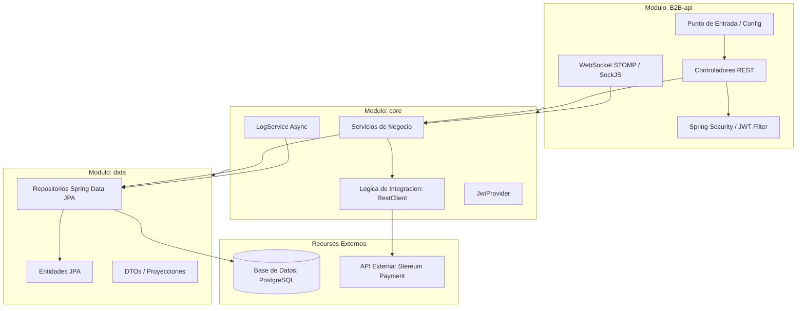

# nada menos

nada menos es una aplicacion empresarial modular desarrollada con Spring Boot y Java 21. El sistema esta disenado para gestionar integraciones de pagos B2B, procesamiento transaccional y notificaciones en tiempo real a traves de WebSockets.

## Arquitectura del Proyecto

El proyecto adopta un patron de arquitectura en capas distribuido en un entorno multimodulo de Maven. Cada capa de la aplicacion esta estrictamente aislada en su propio modulo para garantizar una alta cohesion y un acoplamiento debil.

### Estructura de Modulos

El proyecto se divide en tres modulos principales:

1. **B2B-api**: Capa de presentacion y configuracion del sistema. Contiene los controladores REST, configuraciones de seguridad (Spring Security), interceptores y manejadores de WebSocket, ademas del punto de entrada de la aplicacion.
2. **core**: Capa de negocio. Aloja los servicios, las integraciones con APIs externas, la generacion y validacion de tokens JWT, y la logica de registro asincrono de logs.
3. **data**: Capa de persistencia y modelos de datos. Agrupa las entidades JPA, repositorios, objetos de transferencia de datos (DTOs) estructurados en peticiones/respuestas, proyecciones y enumeradores.

### Diagrama de Arquitectura y Dependencias

El siguiente diagrama ilustra el flujo de datos y la jerarquia de dependencias entre los modulos del sistema:



### Principios de Diseno

- **Patron de Capas**: El flujo de ejecucion sigue la direccion de Controlador a Servicio, y de Servicio a Repositorio de manera unidireccional.
- **DTOs Limpios**: El mapeo de datos se realiza directamente a traves de constructores en los DTOs de respuesta o mediante expresiones new de JPQL en las consultas de los repositorios, evitando el uso de librerias de mapeo dinamico.
- **Auditoria Automatica**: Las entidades que requieren trazabilidad heredan de una superclase de auditoria que registra de manera automatica la fecha de creacion, modificacion, el usuario creador (obtenido del contexto de seguridad o por defecto del sistema) y la version del registro.
- **Autenticacion sin Estado**: Implementada mediante tokens JWT firmados digitalmente.
- **Canales Bidireccionales**: Comunicacion en tiempo real basada en el protocolo STOMP sobre WebSockets con soporte para SockJS.

---

## Tecnologias Utilizadas

- **Lenguaje**: Java 21
- **Framework Principal**: Spring Boot 4.0.6 (Spring MVC, Spring Security, Spring Data JPA)
- **Seguridad**: JJWT (Java JWT) 0.12.6
- **Base de Datos**: PostgreSQL
- **Mensajeria en Tiempo Real**: WebSocket STOMP
- **Contenedores**: Docker y Docker Compose
- **Herramienta de Construccion**: Maven 3.9+

---

## Requisitos Previos

Antes de compilar y ejecutar el proyecto, asegurese de tener instalado en su sistema:

- Java Development Kit (JDK) 21
- Apache Maven 3.9 o superior
- Docker y Docker Compose

---

## Configuracion y Despliegue

### 1. Levantar la Base de Datos

El entorno de desarrollo utiliza PostgreSQL ejecutado en un contenedor Docker. Para iniciar la base de datos, ejecute el siguiente comando desde la raiz del proyecto:

```bash
docker compose -f extra/docker-compose.yaml up -d
```

Este comando descargara la imagen de PostgreSQL y ejecutara los scripts de inicializacion ubicados en el directorio extra para estructurar el esquema inicial de la base de datos.

### 2. Compilar y Construir el Proyecto

Instale todas las dependencias y construya los modulos Maven ejecutando:

```bash
mvn clean install
```

Si desea empaquetar el proyecto en un archivo JAR listo para produccion (excluyendo archivos de configuracion locales como logback.xml y application.properties), utilice el perfil de entorno correspondiente:

```bash
mvn clean package -Denv=prod
```

### 3. Ejecutar la Aplicacion

Para iniciar el servidor de desarrollo local, ejecute el siguiente comando apuntando al modulo de inicio:

```bash
mvn spring-boot:run -pl B2B-api
```

Para ejecutar la aplicacion bajo el perfil de produccion:

```bash
mvn spring-boot:run -pl B2B-api -Dspring-boot.run.arguments="--spring.profiles.active=prod"
```

### 4. Pruebas Unitarias y de Integracion

Ejecute la suite completa de pruebas con el siguiente comando:

```bash
mvn test
```

Para ejecutar una clase de prueba especifica:

```bash
mvn test -pl B2B-api -Dtest=NombreDeLaClaseDePrueba
```

---

## Modulos y Detalles Tecnicos

### Capa de Datos (Modulo: data)
Este modulo contiene las declaraciones del modelo relacional. Las entidades JPA hacen uso de identificadores UUID generados en el motor de base de datos a traves de la funcion gen_random_uuid(). Los valores monetarios estan definidos estrictamente con precision decimal (DECIMAL(14,2)) para evitar problemas de redondeo.

### Capa de Negocio (Modulo: core)
Contiene las reglas de negocio del sistema:
- **Integracion Stereum**: Implementada mediante Spring RestClient para conectarse al proveedor externo de pagos. Las credenciales y URLs base se parametrizan en las propiedades del entorno.
- **Registro Asincrono**: LogService ejecuta el almacenamiento de trazas y logs del sistema en un hilo independiente a traves del executor taskLog utilizando la anotacion @Async con propagacion REQUIRES_NEW para evitar interrumpir las transacciones principales del usuario.

### Capa de API (Modulo: B2B-api)
Expone la interfaz de programacion:
- **Endpoints Publicos**: Los unicos endpoints expuestos sin autenticacion son /api/v1/auth/login, la documentacion tecnica de Swagger/OpenAPI (/swagger-ui/**, /v3/api-docs/**) y el handshake de WebSockets (/ws/**).
- **Seguridad a Nivel de Metodo**: Se habilita mediante @EnableMethodSecurity para validar roles y permisos especificos antes de la ejecucion de cada servicio.
- **WebSocket STOMP**: Habilita la comunicacion en tiempo real por medio de los brokers de mensajes /paymenting y /queue. Los tokens JWT se validan en la fase de conexion del cliente mediante el interceptor WebSocketAuthChannelInterceptor.
